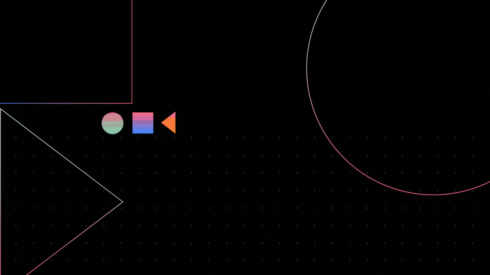

 </img>

###  Hello there !
 &nbsp;
&nbsp;
&nbsp;

### :girl: 💻 &nbsp;About Me

🎓 &nbsp;I'm currently working as an AI Engineer.\
🌱 &nbsp;I love learning about AI, Neuroscience and developing cool websites.\
⚡ &nbsp;When I'm not coding I play guitar!😄 \
💬 &nbsp;Feel free to reach out to me for discussions on the aforementioned topics! 

### 🛠 &nbsp;Tech Stack

&nbsp;
&nbsp;
&nbsp;
&nbsp;
&nbsp;
&nbsp;

### :zap: &nbsp;Github Stats
 
 

### 📫 &nbsp; Reach me out:

 &nbsp;
 &nbsp;
 &nbsp;

<!--
**geeythree/geeythree** is a ✨ _special_ ✨ repository because its `README.md` (this file) appears on your GitHub profile.

Here are some ideas to get you started:

- 🔭 I’m currently working on ...
- 🌱 I’m currently learning ...
- 👯 I’m looking to collaborate on ...
- 🤔 I’m looking for help with ...
- 💬 Ask me about ...
- 📫 How to reach me: ...
- 😄 Pronouns: ...
- ⚡ Fun fact: ...
-->
